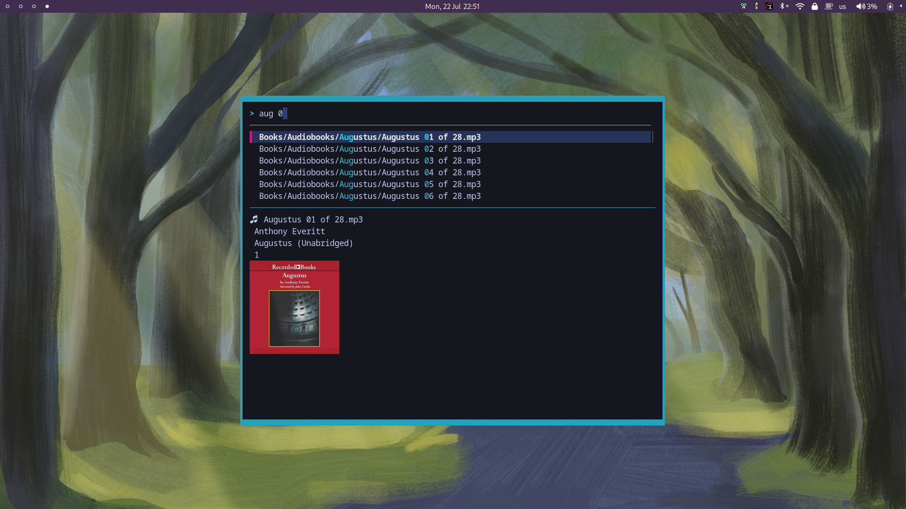

# Hawk
Easily find and launch files from the desktop. Dmenu for your files.

 

# Features
- Finds files fast with `fzf`
- Fuzzy matching makes search easy
- Launches files with `xdg-open` `rifle` or your own script
- Opens in a terminal window, so Hawk is lightweight and always matches your theme
- Previews files
- Integrates easily into Sway or your favorite wm
- Customize with a simple ini file

# Instructions
**Sway Integration**
* Copy `hawk.fish` and `hawk-preview.fish` to your `~/.local/bin`
* Insert the following line to your sway config:\
    `bindsym $mod+Shift+d $hawk`
* Add `include hawk-sway` to your sway config and place `hawk-sway` in .config/sway/

**Dependencies**\
Required: `fish` `fzf`\
Optional: `chafa` `ffmpeg` `odt2txt` `pdftotext`

